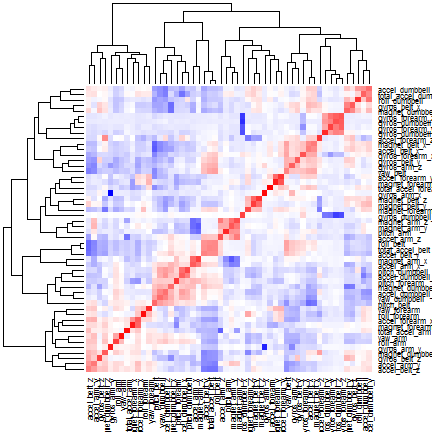

# Practical Machine Learning

Using devices such as Jawbone Up, Nike FuelBand, and Fitbit it is now possible to collect a large amount of data about personal activity relatively inexpensively. These type of devices are part of the quantified self movement - a group of enthusiasts who take measurements about themselves regularly to improve their health, to find patterns in their behavior, or because they are tech geeks. One thing that people regularly do is quantify how much of a particular activity they do, but they rarely quantify how well they do it.
In this project, the goal will be to use data from accelerometers on the belt, forearm, arm, and dumbell of 6 participants. They were asked to perform barbell lifts correctly and incorrectly in 5 different ways.
More information is available from the website here: http://groupware.les.inf.puc-rio.br/har.

### Data

Data is downloaded from used and read as csv files


```r
set.seed(1)
library(lattice)
library(ggplot2)
library(caret)
library(randomForest)
```

```
## randomForest 4.6-10
## Type rfNews() to see new features/changes/bug fixes.
```

```r

training.url <- "https://d396qusza40orc.cloudfront.net/predmachlearn/pml-training.csv"
testing.url <- "https://d396qusza40orc.cloudfront.net/predmachlearn/pml-testing.csv"
training.file <- "pml-training.csv"
testing.file <- "pml-testing.csv"
# download.file(training.url, training.file) download.file(testing.url,
# testing.file)
read.pml <- function(x) {
    read.csv(x, na.strings = c("", "NA", "#DIV/0!"))
}
training <- read.pml(training.file)
training.rows = nrow(training)
training.cols = ncol(training)
```

```
head(training)
```

Data has 19622 rows and 160 column, first 7 column present participant name, time window and time stamp data, they are remove as predictors. Sereval columns are mainly "NA" or "#DIV/0!" values, only columns with less than 10% na values are allowed as predictors.


```r
# drop columns 1:7
training[1:7] <- list(NULL)
# keep columns with less than % na values
training <- training[, colMeans(is.na(training)) < 0.1]
training.cols = ncol(training)
```


The size of columns are reduced to 53. Also near zero variance predictors are removed, but are is no pressence of near zero variance predictorsin the remaining columns.


```r
nearZeroColumns <- nearZeroVar(training, saveMetrics = TRUE)
training <- training[, nearZeroColumns$nzv == FALSE]
training.cols = ncol(training)
```


Plot the correlation between predictors.


```r
pred.corr <- cor(subset(training, select = -c(classe)))
heatmap(pred.corr, col = colorRampPalette(c("blue", "white", "red"))(n = 199))
```

 


In the heat map of the correlation matrix, most of predictors do not exhibit high degree of correlation.

### Data

Data is split in train and test sets ussing "classe" to perform cross validation.


```r
training.train.index <- createDataPartition(training$classe, p = 0.7, list = FALSE)
training.train <- training[training.train.index, ]
training.test <- training[-training.train.index, ]
```


### Model

Random forest has been choosed as model algorithm. Positive factors on RF are the speed, the interpretability and dealing with overfitting. Therefore, it's always better to use more trees, memory and computational power allowing.

The algorithm allows for good in-training estimates of variable importance and generalization error, which largely eliminates the need for a separate validation stage. But in order to obtain an out of sample rate and to compare with the train method from caret, the model will be training using 70% of the training data.


```r
model.rf.1 <- randomForest(classe ~ ., data = training.train, ntree = 100)
model.rf.1
```

```
## 
## Call:
##  randomForest(formula = classe ~ ., data = training.train, ntree = 100) 
##                Type of random forest: classification
##                      Number of trees: 100
## No. of variables tried at each split: 7
## 
##         OOB estimate of  error rate: 0.76%
## Confusion matrix:
##      A    B    C    D    E class.error
## A 3897    7    1    0    1    0.002304
## B   21 2630    5    2    0    0.010534
## C    0   19 2367   10    0    0.012104
## D    0    0   26 2224    2    0.012433
## E    0    0    4    7 2514    0.004356
```

```r
training.test.prediction <- predict(model.rf.1, newdata = training.test)
confusionMatrix(training.test.prediction, training.test$classe)
```

```
## Confusion Matrix and Statistics
## 
##           Reference
## Prediction    A    B    C    D    E
##          A 1671    2    0    0    0
##          B    1 1136    6    0    0
##          C    0    1 1020    6    0
##          D    0    0    0  957    2
##          E    2    0    0    1 1080
## 
## Overall Statistics
##                                         
##                Accuracy : 0.996         
##                  95% CI : (0.995, 0.998)
##     No Information Rate : 0.284         
##     P-Value [Acc > NIR] : <2e-16        
##                                         
##                   Kappa : 0.995         
##  Mcnemar's Test P-Value : NA            
## 
## Statistics by Class:
## 
##                      Class: A Class: B Class: C Class: D Class: E
## Sensitivity             0.998    0.997    0.994    0.993    0.998
## Specificity             1.000    0.999    0.999    1.000    0.999
## Pos Pred Value          0.999    0.994    0.993    0.998    0.997
## Neg Pred Value          0.999    0.999    0.999    0.999    1.000
## Prevalence              0.284    0.194    0.174    0.164    0.184
## Detection Rate          0.284    0.193    0.173    0.163    0.184
## Detection Prevalence    0.284    0.194    0.175    0.163    0.184
## Balanced Accuracy       0.999    0.998    0.996    0.996    0.999
```


We have an estimated out of bag error of 0.76%. Accuracy is 99.60%, out of sample is 0.40%

# Prediction

We are ready to read the testing file and predict the values.

```
testing <- read.pml(testing.file)
testing.prediction<-predict(model.rf,newdata=testing)
testing.prediction
pml_write_files = function(x){
  n = length(x)
  for(i in 1:n){
    filename = paste0("problem_id_",i,".txt")
    write.table(x[i],file=filename,quote=FALSE,row.names=FALSE,col.names=FALSE)
  }
}
pml_write_files(testing.prediction)
```

After submitted the result to the web site, 100% accurary on the testing set has been achieved.

# Conclusion

Random forest looks like good choice to predict the data, it would be interesting to try different configuration params for training or using another algorithms.

# More Experiments

Now, we are taking advantages of caret package, the numbers of predictors will be selected by the process, using 10 folds and will train using 4 different predictor selection set size, it will take 40 times longer than the single training


```r
control <- trainControl(method = "repeatedcv", number = 10)
model.rf.2 <- train(classe ~ ., training.train, method = "rf", trControl = control, 
    ntree = 100, tuneLength = 4)
model.rf.2
```

```
## Random Forest 
## 
## 13737 samples
##    52 predictor
##     5 classes: 'A', 'B', 'C', 'D', 'E' 
## 
## No pre-processing
## Resampling: Cross-Validated (10 fold, repeated 1 times) 
## 
## Summary of sample sizes: 12362, 12363, 12363, 12362, 12365, 12361, ... 
## 
## Resampling results across tuning parameters:
## 
##   mtry  Accuracy  Kappa  Accuracy SD  Kappa SD
##    2    1         1      0.002        0.003   
##   18    1         1      0.002        0.003   
##   35    1         1      0.003        0.004   
##   52    1         1      0.003        0.004   
## 
## Accuracy was used to select the optimal model using  the largest value.
## The final value used for the model was mtry = 18.
```

```r
model.rf.2$finalModel
```

```
## 
## Call:
##  randomForest(x = x, y = y, ntree = 100, mtry = param$mtry) 
##                Type of random forest: classification
##                      Number of trees: 100
## No. of variables tried at each split: 18
## 
##         OOB estimate of  error rate: 0.68%
## Confusion matrix:
##      A    B    C    D    E class.error
## A 3899    4    1    1    1    0.001792
## B   13 2634    9    0    2    0.009029
## C    0   16 2372    8    0    0.010017
## D    0    1   25 2225    1    0.011989
## E    0    2    4    6 2513    0.004752
```

```r
training.test = training[!(rownames(training) %in% rownames(model.rf.2$trainingData)), 
    ]
training.test.prediction <- predict(model.rf.2, newdata = training.test)
confusionMatrix(training.test.prediction, training.test$classe)
```

```
## Confusion Matrix and Statistics
## 
##           Reference
## Prediction    A    B    C    D    E
##          A 1670    3    0    0    0
##          B    1 1134    5    0    0
##          C    1    2 1020    4    0
##          D    0    0    1  958    2
##          E    2    0    0    2 1080
## 
## Overall Statistics
##                                         
##                Accuracy : 0.996         
##                  95% CI : (0.994, 0.998)
##     No Information Rate : 0.284         
##     P-Value [Acc > NIR] : <2e-16        
##                                         
##                   Kappa : 0.995         
##  Mcnemar's Test P-Value : NA            
## 
## Statistics by Class:
## 
##                      Class: A Class: B Class: C Class: D Class: E
## Sensitivity             0.998    0.996    0.994    0.994    0.998
## Specificity             0.999    0.999    0.999    0.999    0.999
## Pos Pred Value          0.998    0.995    0.993    0.997    0.996
## Neg Pred Value          0.999    0.999    0.999    0.999    1.000
## Prevalence              0.284    0.194    0.174    0.164    0.184
## Detection Rate          0.284    0.193    0.173    0.163    0.184
## Detection Prevalence    0.284    0.194    0.175    0.163    0.184
## Balanced Accuracy       0.998    0.997    0.996    0.997    0.999
```


We have an estimated out of sample error rate of 0.68% using 18 predictors at each split. test set leave out by train is calculated from training not selecting the trainingData selected by the process. On the test set we have an accurary of 99.60%, out of sample error of 0.40%.
